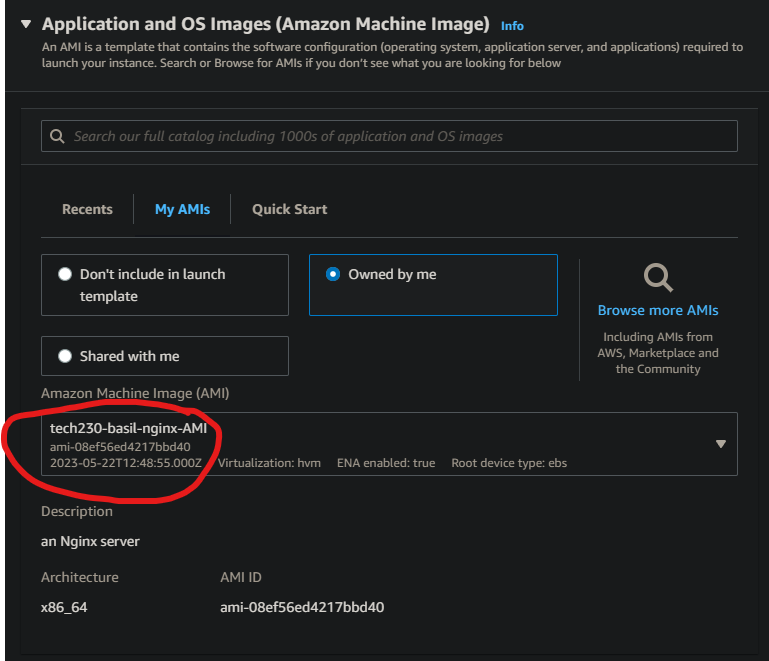
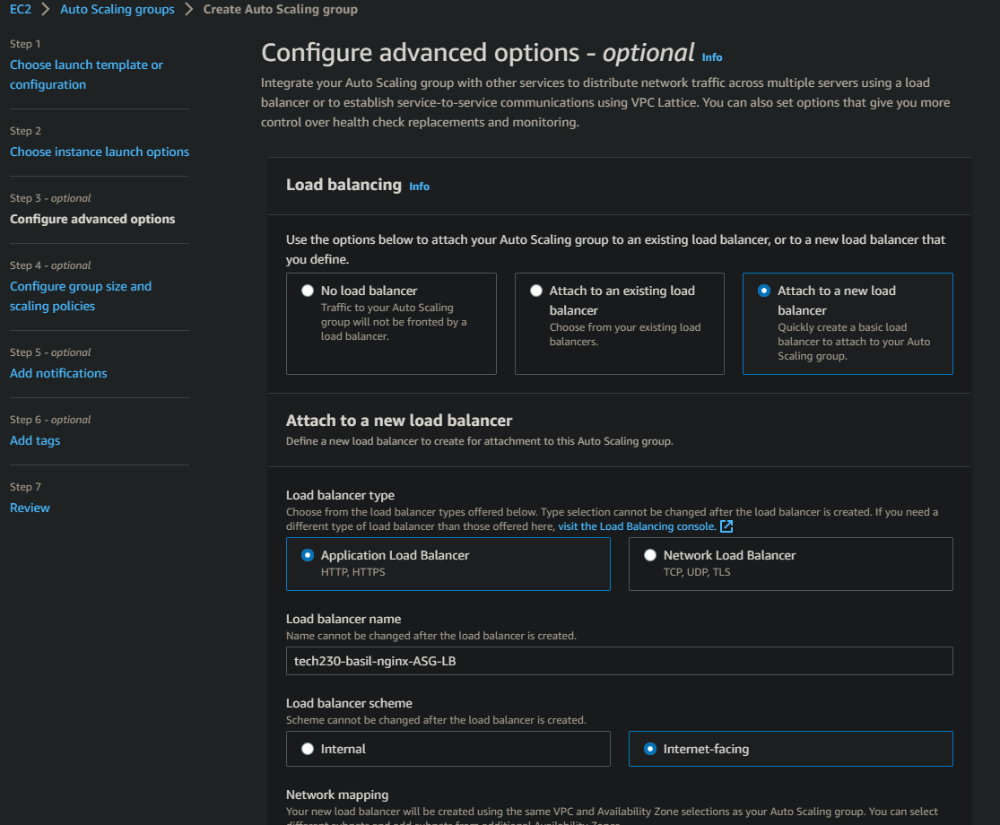
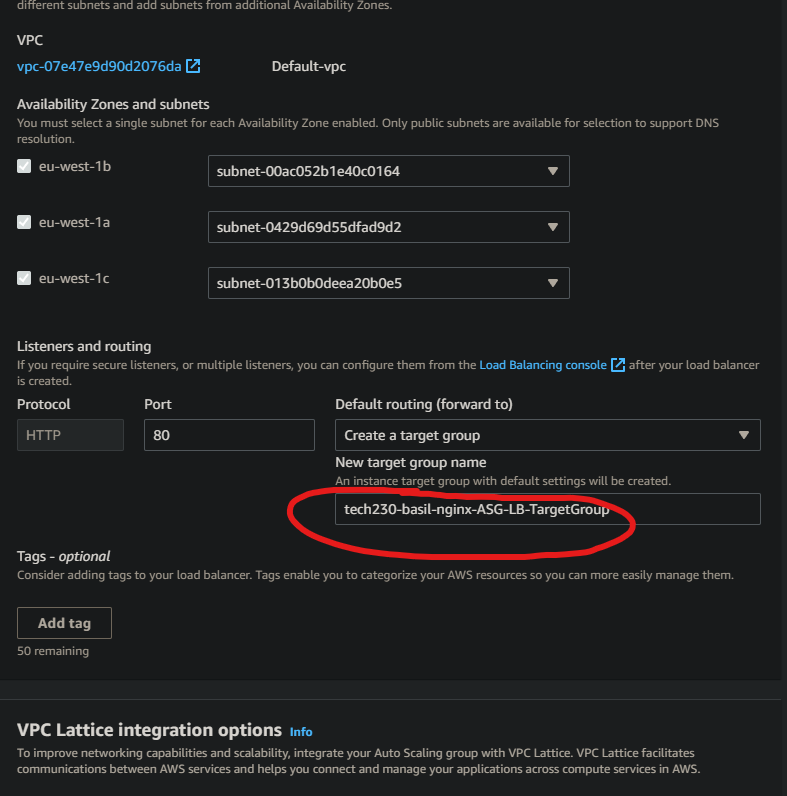
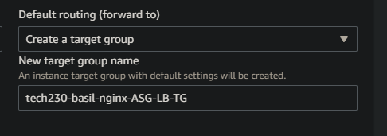
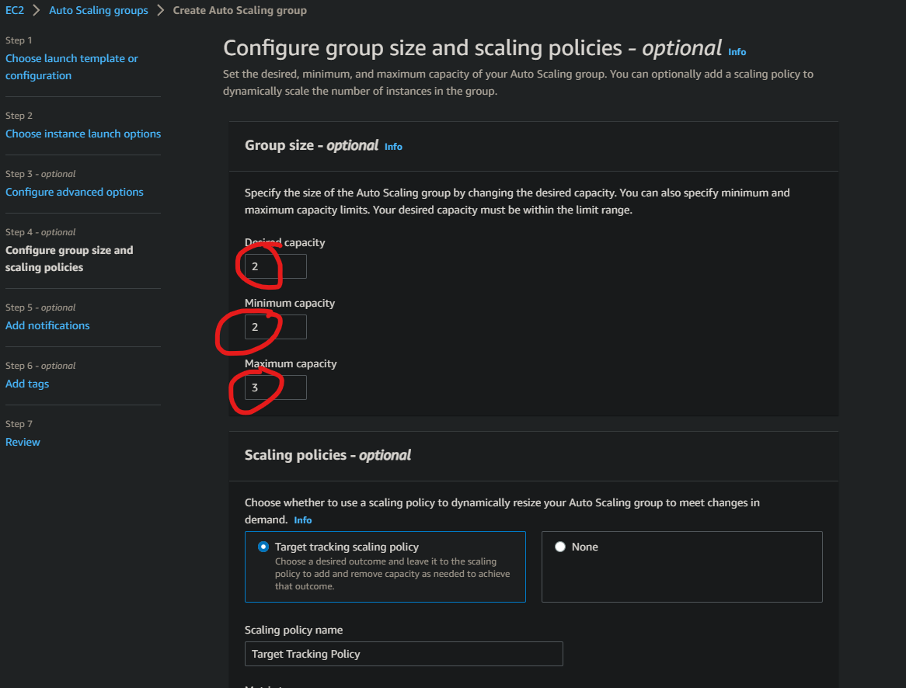
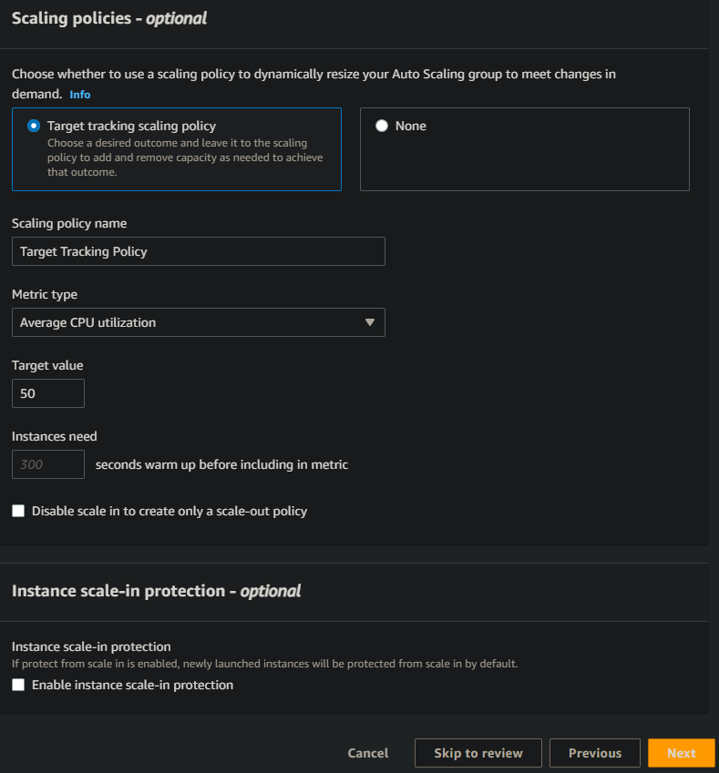
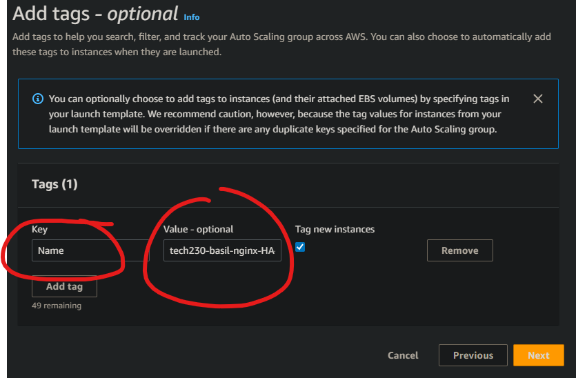
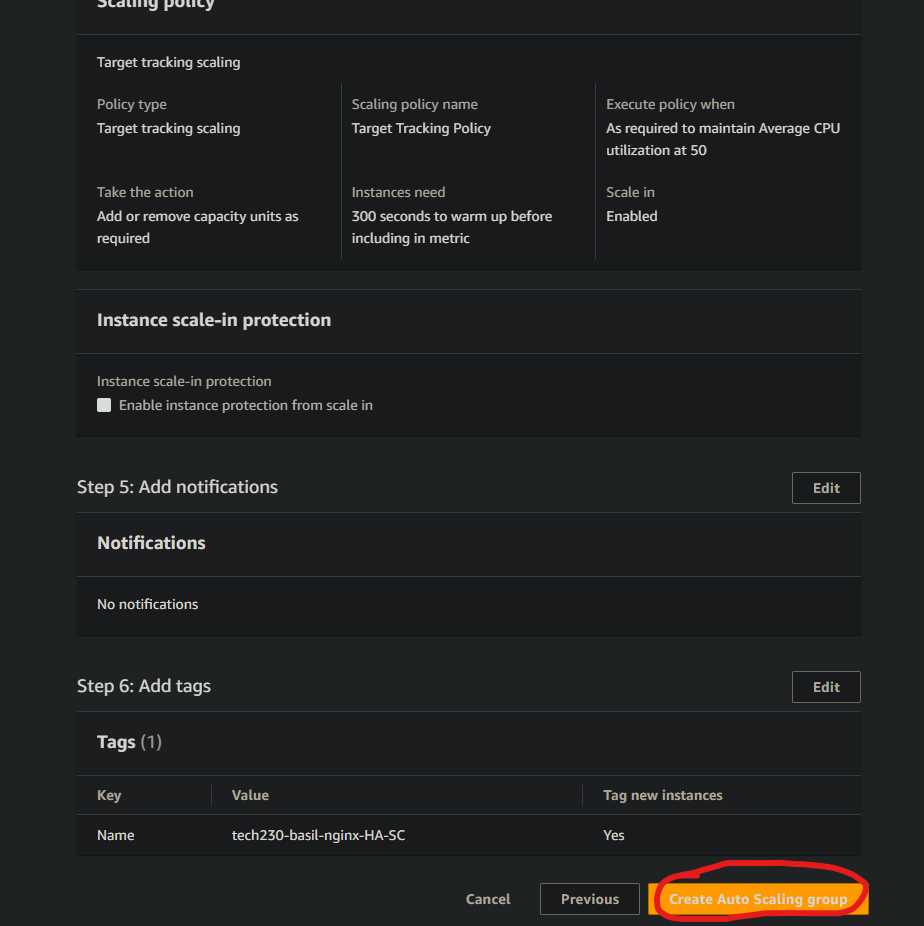

# Setting up ASG

1. Create EC2 instance, as before
2. Populate EC2 using user data, in VM provision script or maunually.
3. Instance state >


4. Name and put a approriate description then create image 
5. Click on launch templates, 
6. Create launch template : 
7. Name the template approriately (include LT at the end of the name to imply its a template)
8. Choose the AMI you made previously, 
9. Make the instance tpye t2.micro 
10. choose the appropriate key-pair 
11. Select the approriate security group
12. You would put all the commands to run the app in the user data section. Then Create launch template
13. You now have a launch template
# Auto scaling groups
1. Go to AGS from side dropdown 
2. 
3. name appropriately.
4. Keep defualt VPC and choose appropriate AZs
5. Attach to a new load balancer, (applicationa load balancer), (internet-facing) 
6. name TG appropriately, if too many charcters then write TG instead, , 
7. Tick turn on Elastic Load blaancing health checks and next
8. Configure wanted group size and scaling policies, tick target tracking scaling policy
9. set average CPU and target value 50, or whatever is required.
10. Put "Name" in the key and "tech230-....-HA-SC" (High availablility, Scaleablility) or anything that is linked to the ASG and makes sense and next
11. Review and we are ready to create the Auto Scaling Group! (ASG) 
12. If created should get prompt
13. After its made, make sure to access the ASG throguh the load balancer 
14. Use the DNS name link to access the website (do not include (A Record) ) 
15. For the app, simply use an AMI that works : "ami-07ef3b45fdbadc36" is mine, then in the user data in8 the launch template include the following 
```bash
#!/bin/bash

cd /home/ubuntu/app

npm install

pm2 start app.js
```
and done.