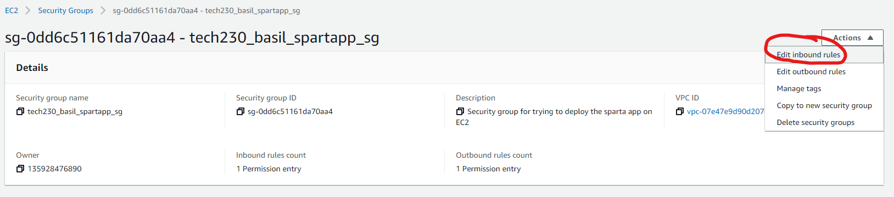

# Getting a EC2 instance up

1. Login to AWS and you should be on your dashboard:


2. Search and click on EC2 in the search bar:


3. Click on Launch instance
4. Use the naming convention `tech230_<your name>_instance desc_<instance type>` for example `tech230_basil_first_ec2`
   s
5. Pick the `ubuntu` system and specifically the `20.04 version`:
6. Make sure the instance tpye is `t2.micro` this should be the default: 
7. pick the `tech230` rsa key pair name : 
8. Edit the security group:
8.1. Name the security group using the appropriate naming convention as before and add an appropriate description 


9. Make sure your summary looks like this then we can click on Launch instance: 
This should appear if all goes well: 

10. now click on instances: 
11. On the page type `instance state = running` and press `enter` to add this filter, so its easy to find your new instance, and wait abit as the instance initializes, you can click the circled refresh button to see updated status. When your instance has succeeded in its checks its will show the running state and we we will be ready to move on to the next step 
12. Once instance state is running we can click the associated instance ID link:
13. You will be taken to this page click on connect:
14. You will now see this page: 
You will need to open your bash terminal and make sure you are in you .ssh directory and then type the command 
```
cd ~/.ssh
```
```bash
chmod 400 tech230.pem
```
followed by (change according to your server) make sure you are in your .ssh directory: `cd ~/.ssh`
```bash
ssh -i "tech230.pem" ubuntu@ec2-34-242-218-126.eu-west-1.compute.amazonaws.com
```
then we input commands we previously used :
```bash
sudo apt update -y
```

```bash
sudo apt upgrade -y
```
>note: using apt not apt-get since its a newer version of linux


```bash
sudo apt install nginx
```
```bash
sudo systemctl start nginx
```
```bash
sudo systemctl enable nginx
```
15. Go to the security tab in the summary page and click on the security groups linkS

then click on

then add rule:

then add the http and https with `0.0.0.0/0` ips so anyone can access them for now and click save
16. Should be able to access the nginx website now using the public IPv4 address found on the instance summary page: 
17. Should see the nginx website when you click the link: 
18. When you are finished with the instance remember to terminate it : 


# Porvisioning 

1. When making the instance scroll down to advanced details and go to the user data box (This is where you write your shell script):

# Creating AMIs
Once you have your EC2 instance in a place you want it, you can make a template that stores all the information about it, so you can launch it anytime, even make multiple instances with the same properties:
1. Select your machine and under actions > image and templates > click on creat template from instance:

2. Give you AMI an appropraite name and description: 

3. Create it: 

4. You can now access this AMI anytime when launching an instance by first selecting launch instance from template: 
   
then choosing the ami you want to use : 

You can even choose the amount of instances you want to launch with this AMI, then click Launch instance.

# Setting up the app from the Nginx img
1. Since we made an image of the nginx setup we can now launch that template and run our app from it, firstly we need to get the app folder from our local directory to the VM using the command:(do this from bash on your local machine)
```bash
scp -r -i ~/.ssh/tech230.pem ~/documents/app ubuntu@ec2-34-245-87-61.eu-west-1.compute.amazonaws.com:/home/ubuntu
```
- The -r option tells scp to copy the directory and its content recursively
- ~/.ssh/tech230.pem is the path to our pem file
- ~/documents/app is the path to the folder we want to copy
- ubuntu@ec2-34-245-87-61.eu-west-1.compute.amazonaws.com is the username and public DNS
- /home/ubuntu is where we want the file to be copied to

This command will take a while to copy all the files wait around 5 minutes

2. Now connect to your EC2(use instance specific ip): 
```bash
ssh -i ~/.ssh/tech230.pem ubuntu@ec2-34-245-87-61.eu-west-1.compute.amazonaws.com
```
1. Install the dependencies in `cd app` :
```bash
curl -sL https://deb.nodesource.com/setup_12.x | sudo -E bash -
```
```bash
sudo apt-get install nodejs -y
```
```bash
sudo npm install pm2 -g
```
1. Start the website in the background:
```bash
pm2 start app.js
```
1. To allow access to the website we should change access permissions for port 3000, so go to your security group settings  and edit inbound rules:
2. Allow public access to port 3000:
3. While you are here change ssh permission to only allow you to enter the instance: 
4. You should be able to access your sparta app using the publicip:3000 :  This will be available publicly this time as it is a public IP address

# Setting up the MongoDB instance:
1. Start an EC2 instance as before and connect to it.
2. Once inside enter the following bash commands to get up and running: 
```bash
sudo apt-get update -y
```
```bash
sudo apt-get upgrade -y
```
```bash
sudo apt-key adv --keyserver hkp://keyserver.ubuntu.com:80 --recv D68FA50FEA312927
```
Create a list file for MongoDB.

You need to create the /etc/apt/sources.list.d/mongodb-org-4.2.list file for Ubuntu 20.04 (Focal):
```bash
echo "deb [ arch=amd64,arm64 ] https://repo.mongodb.org/apt/ubuntu bionic/mongodb-org/4.2 multiverse" | sudo tee /etc/apt/sources.list.d/mongodb-org-4.2.list
```
Reload local package database.

Issue the following command to reload the local package database:
```bash
sudo apt-get update
```

Install the MongoDB packages.

You can install either the latest stable version of MongoDB or a specific version of MongoDB.

To install the latest stable version, issue the following command:
```bash
sudo apt-get install -y mongodb-org

```
This command will install the latest stable version of MongoDB along with helpful management tools for the MongoDB server.

Start MongoDB.

Issue the following command to start mongod:
```bash
sudo systemctl start mongod
```
If you want MongoDB to start when you boot your system, you can issue the following command:
```bash
sudo systemctl enable mongod
```
Verify that MongoDB has started successfully.

Issue the following command to verify that MongoDB has started successfully:
```bash
sudo systemctl status mongod
```
Now we have MongoDB 4.2 installed on our Ubunutu system.
# If we wanted to install MongoDB 3.6 we can do the following commands instead straight from the userdata(provision)

```bash
#!/bin/bash

sudo apt update -y

sudo apt upgrade -y

sudo apt-key adv --keyserver hkp://keyserver.ubuntu.com:80 --recv D68FA50FEA312927

sudo apt install mongodb -y

sudo systemctl start mongodb

sudo systemctl enable mongodb
```


# Connecting app and db
1. Add the security group to allow access to MongoDB on port 27017:


2. In the Mongo server, Make sure to change the mongo config file `sudo nano /etc/mongodb.conf` ip to 0.0.0.0 to allow anyone to connect to MongoDB.
3. after this type the command

```bash
sudo systemctl restart mongodb
```
4. In the app server add (make sure you are in the home directory)
```bash
export DB_HOST=mongodb://<current_mongoserver_Public_Ip_this_changes_every_restart:27017/posts
```
to the .bashrc file then 
```
source .bashrc
```
5. Now `cd app` and run 
```
npm install
``` 
and this should seed to the server.

6. Start the app with the command 
```bash
pm2 start app.js --update-env
```
