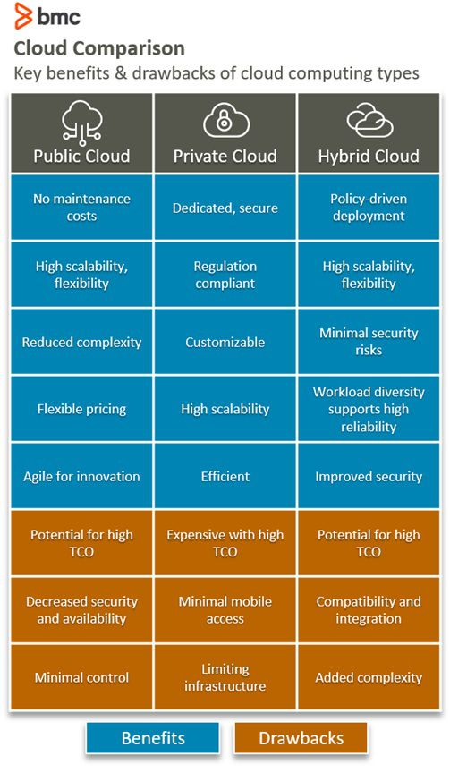

# Cloud Computing

## What is cloud computing?

Cloud computing refers to the delivery of computing services, such as storage, processing power, and software applications, over the internet. Instead of relying on local servers or personal devices, cloud computing allows users to access and use resources hosted on remote servers. These resources are typically provided by third-party service providers, who maintain and manage the underlying infrastructure.

## Quick history of cloud computing

Cloud computing has its roots in the concept of time-sharing, which emerged in the 1950s and allowed multiple users to access a single computer simultaneously. The development of virtualization technologies in the 1960s and 1970s paved the way for the modern concept of cloud computing. In the early 2000s, companies like Amazon, Google, and Salesforce began offering cloud-based services to the public, marking the beginning of the widespread adoption of cloud computing.

## What are the benefits of cloud computing?

Some key benefits of cloud computing include:

1. **Scalability**: Cloud services can easily scale up or down based on the user's needs, allowing businesses to quickly adapt to changing demands.
2. **Cost efficiency**: Cloud computing eliminates the need for upfront investments in hardware and infrastructure, as users only pay for the resources they consume.
3. **Flexibility and accessibility**: Cloud services can be accessed from anywhere with an internet connection, enabling remote work and collaboration.
4. **Reliability and availability**: Cloud providers typically offer robust infrastructure with redundancy and backup mechanisms, ensuring high availability of services.
5. **Security**: Cloud providers employ advanced security measures and regular updates to protect data and applications from threats.

## What are the main benefits of cloud computing for a business?

For businesses, cloud computing offers several advantages:

1. **Cost savings**: Cloud services eliminate the need for maintaining on-premises infrastructure, reducing hardware and maintenance costs.
2. **Scalability**: Businesses can easily scale their resources up or down as per their requirements, avoiding the need for overprovisioning or capacity constraints.
3. **Increased productivity**: Cloud-based collaboration tools and remote access enable teams to work together more efficiently, regardless of their physical location.
4. **Business continuity**: Cloud providers often have built-in disaster recovery and backup mechanisms, ensuring data is protected and available in case of any disruptions.
5. **Streamlined operations**: Cloud services handle maintenance, updates, and security, allowing businesses to focus on their core competencies rather than IT infrastructure management.

## What is AWS?

AWS (Amazon Web Services) is a comprehensive cloud computing platform offered by Amazon. It provides a wide range of cloud services, including computing power, storage, databases, networking, machine learning, and more. AWS offers a pay-as-you-go model, where users pay for the resources they consume, making it a cost-effective solution for businesses of all sizes.

## Quick history of AWS

AWS was officially launched by Amazon in 2006, aiming to provide cloud infrastructure services to businesses and individuals. It started with offerings such as Amazon Simple Storage Service (S3) for storage and Amazon Elastic Compute Cloud (EC2) for computing power. Over time, AWS expanded its service portfolio and became a leader in the cloud computing market. Today, AWS is widely used by organizations around the world, ranging from startups to large enterprises.

## Who are the other main cloud service providers?

Apart from AWS, some of the other major cloud service providers include:

1. **Microsoft Azure**: Microsoft Azure is a cloud computing platform offered by Microsoft. It provides a broad range of cloud services and integrates well with existing Microsoft tools and technologies.

2. **Google Cloud Platform (GCP)**: GCP is Google's cloud computing platform, offering a wide array of services, including computing, storage, machine learning, and data analytics

## What is IaaS, PaaS, and SaaS? Make a diagram please.

IaaS (Infrastructure as a Service): Provides virtualized computing resources over the internet, such as virtual machines, storage, and networks. Users have control over the operating systems and applications they deploy.

PaaS (Platform as a Service): Offers a platform for developing, running, and managing applications without worrying about the underlying infrastructure. It provides tools, frameworks, and services to streamline the application development process.

SaaS (Software as a Service): Delivers software applications over the internet on a subscription basis. Users can access and use these applications through a web browser without the need for local installation.

Diagram:

## What is the difference between public cloud, hybrid cloud, and private cloud?

- **Public Cloud**: A public cloud is a cloud infrastructure shared among multiple organizations or users. It is owned and operated by a third-party cloud service provider, who makes the services available to the public over the internet.

- **Hybrid Cloud**: A hybrid cloud combines both public and private cloud infrastructure, allowing data and applications to be shared between them. It provides flexibility, enabling organizations to leverage the scalability of the public cloud while maintaining sensitive data or critical applications in a private cloud.

- **Private Cloud**: A private cloud is a cloud infrastructure dedicated to a single organization. It can be hosted on-premises or by a third-party service provider. Private clouds offer enhanced control, security, and customization options, but they require more resources for maintenance.

## What types of industry/business use the different types of cloud? (e.g., who uses a private cloud?)

- **Public Cloud**: Public cloud is commonly used by startups, small and medium-sized businesses, and organizations that require scalability and cost-effectiveness without the need for significant infrastructure investments.

- **Hybrid Cloud**: Hybrid cloud is often utilized by enterprises and industries with strict compliance requirements, such as healthcare and finance. It allows them to take advantage of public cloud benefits while maintaining control over sensitive data.

- **Private Cloud**: Private cloud is frequently adopted by government agencies, large enterprises, and industries with strict data privacy and security concerns. It provides more control, customization, and isolation for critical applications and sensitive data.

## What is Operating Expenditure (OpEx) and what is Capital Expenditure (CapEx)?

- **Operating Expenditure (OpEx)**: OpEx refers to ongoing expenses incurred by a business to maintain its operations, such as utility bills, salaries, and maintenance costs. OpEx is treated as a day-to-day operational expense and is fully deductible in the year incurred.

- **Capital Expenditure (CapEx)**: CapEx refers to expenses incurred by a business to acquire, upgrade, or extend its assets, such as purchasing equipment, infrastructure, or software licenses. CapEx is considered an investment and is usually depreciated or amortized over time.

## Which is preferable, and how does the cloud allow businesses to transfer to spending more on the preferred one?

The preference between OpEx and CapEx depends on various factors, including the financial situation, scalability needs, and long-term business goals of an organization. However, many businesses prefer OpEx over CapEx due to the following reasons:

1. **Cost efficiency**: Cloud computing enables businesses to shift from upfront CapEx investments to a pay-as-you-go OpEx model. This allows organizations to avoid large upfront costs associated with purchasing and maintaining infrastructure, and instead, pay for the resources they consume on a flexible basis.

2. **Scalability**: The cloud offers the ability to easily scale resources up or down based on business needs. This scalability eliminates the need for overprovisioning or capacity constraints typically associated with CapEx investments.

3. **Flexibility and agility**: Cloud services provide businesses with the flexibility to quickly adapt to changing market conditions and customer demands. By leveraging the cloud, organizations can rapidly deploy and scale applications, test new ideas, and innovate at a faster pace.

## Summarize 3 Case studies on companies that have transferred to the Cloud and what that has allowed them to do?

1. **Netflix**: Netflix transitioned from a traditional DVD rental service to a streaming media platform by leveraging the cloud. By migrating its infrastructure to Amazon Web Services (AWS), Netflix gained the ability to scale its streaming service globally, deliver content efficiently, and handle spikes in demand during peak usage. This move allowed Netflix to transform the way people consume media and become a leading player in the streaming industry.

2. **Airbnb**: As a rapidly growing online marketplace for accommodations, Airbnb moved its infrastructure to AWS to handle its increasing user base and global expansion. By using the cloud, Airbnb was able to scale its platform to support millions of listings and bookings, ensure high availability, and provide a seamless experience to its users across different regions. The cloud allowed Airbnb to focus on its core business and customer experience while relying on the robust infrastructure and services provided by AWS.

3. **Capital One**: Capital One, a financial services company, migrated a significant portion of its IT infrastructure to the cloud to enhance agility and innovation. By adopting a cloud-first strategy and leveraging AWS, Capital One improved its ability to rapidly develop and deploy new digital banking services and applications. The cloud allowed Capital One to streamline its operations, reduce time-to-market, and deliver enhanced banking experiences to its customers while maintaining security and compliance standards.

# We use it everyday 

Cloud Storage Services:

- Google Drive
- Dropbox

Web-Based Email Services:

- Gmail
- Outlook.com
  
Video Streaming Platforms:

- Netflix
- YouTube

Social Media Platforms:

- Facebook
- Twitter

Cloud-based Productivity Suites:

- Google Workspace
- Microsoft 365

Cloud-Based Communication Tools:

- Slack
- Microsoft Teams
