# VPC
# Table of Contents
1. [Create a VPC](#create-a-vpc)
2. [Create IGW](#create-igw)
3. [Connect IGW to VPC](#connect-igw-to-vpc)
4. [Create subnet/s](#create-subnets)
5. [Create public RT](#create-public-rt)
6. [Link public RT to subnet]()
7. [Link IGW to RT](#link-igw-to-rt)
8. [Launching our EC2s](#launching-our-ec2s)
9. [End](#posts-page-should-be-working-if-all-is-done-correctly)

Glossary:
- VPC - Virtual Private Cloud
- IGW - Internet Gateway
- RT - Route table

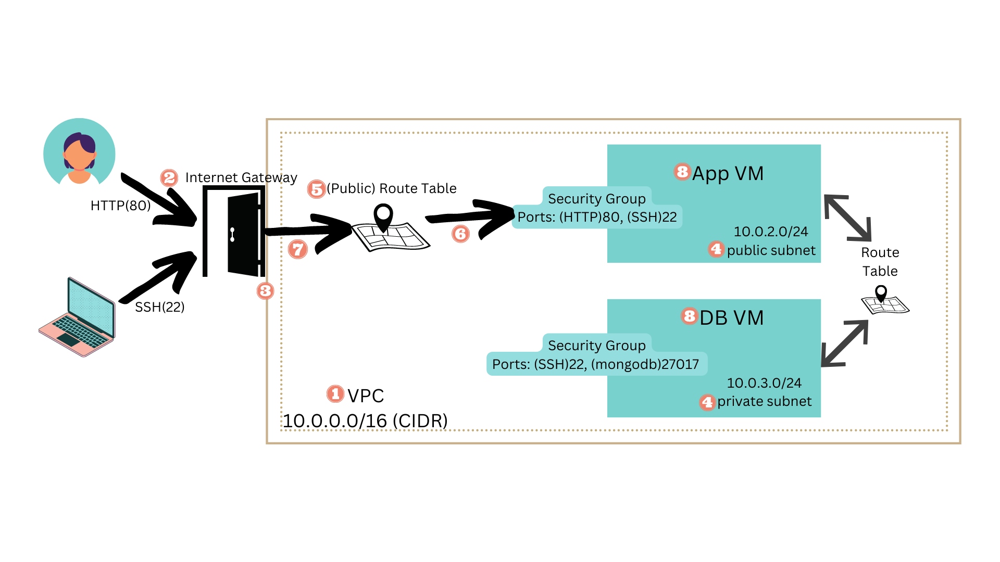

# Create a VPC
1. 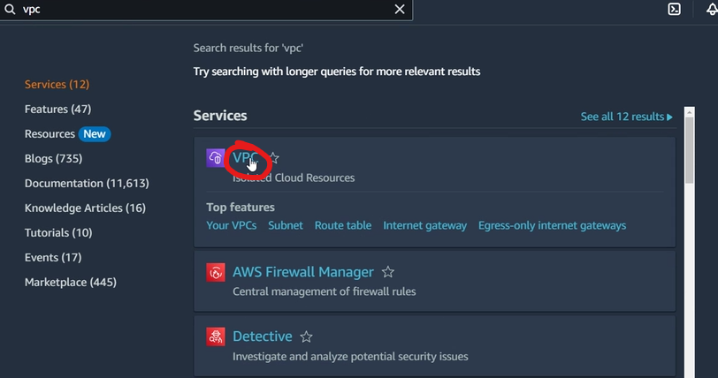
2. 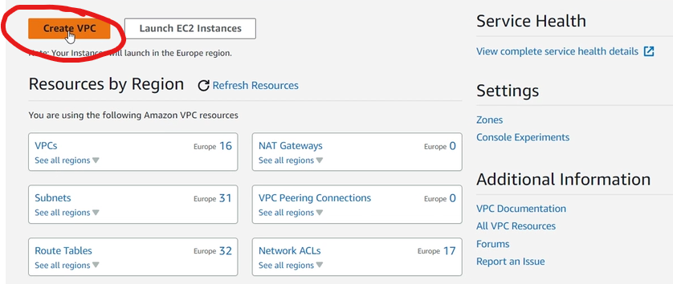
3. 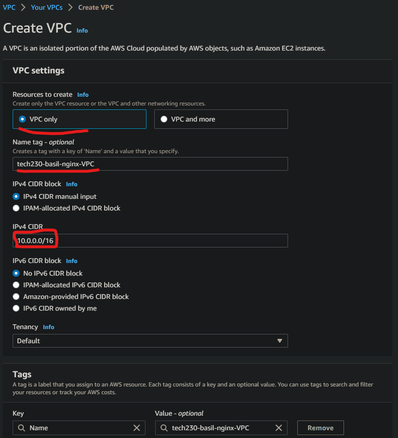
4. 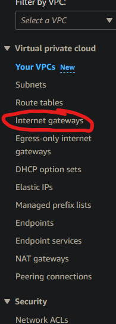
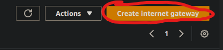

# Create IGW
1. 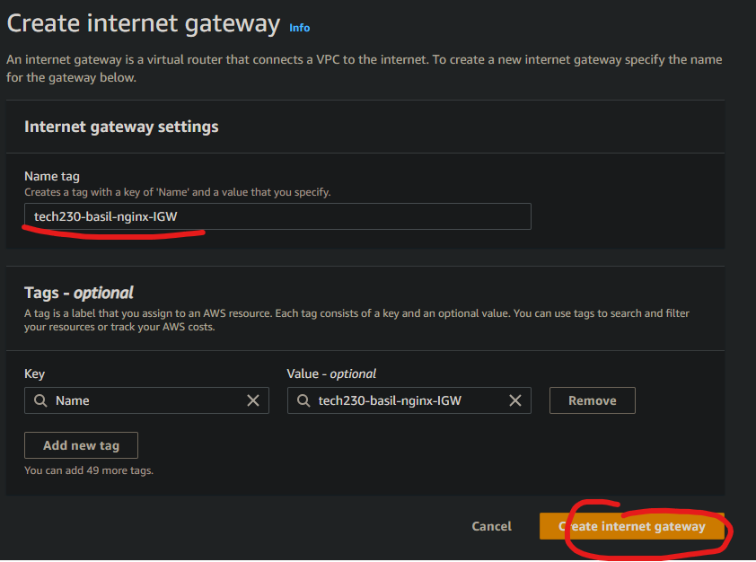

# Connect IGW to VPC
2. 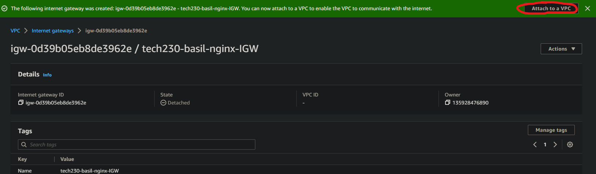
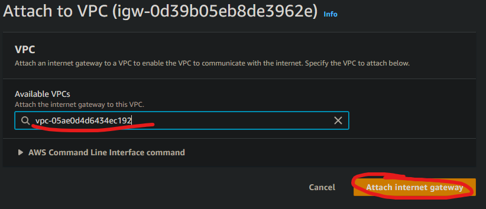

# Create subnet/s
## Create 2 subnets - one for the app, other for the DB

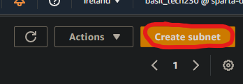
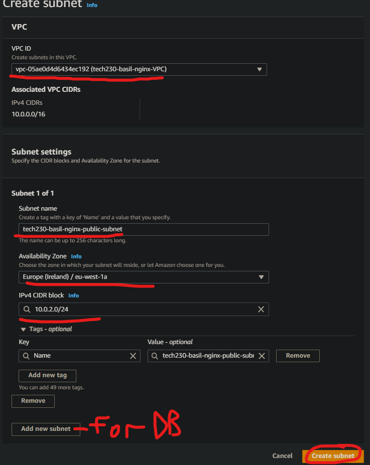

# Create public RT
## Change the name of the main RT to private for ease of reference ( dont need to do this)
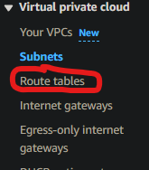
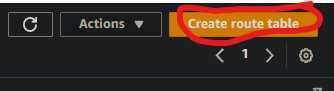
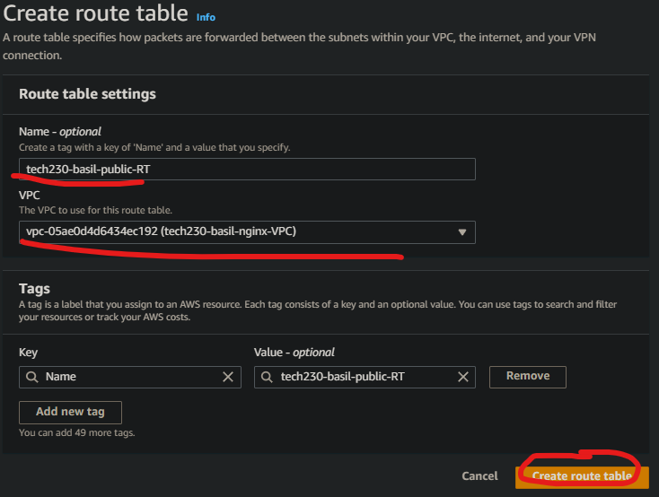
# Link public RT to subnet

## Link both public and private RT to their respective subnet ( the private subnet should be automatically linked to the main RT thats automatically built so **only manual step should be to link the public RT to the public subnet**)
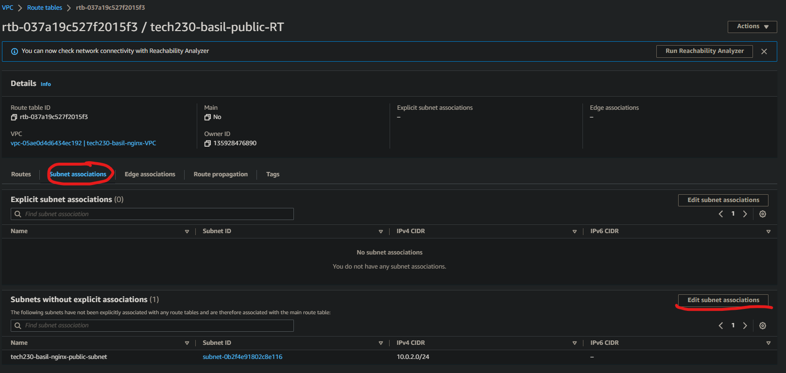
.png)
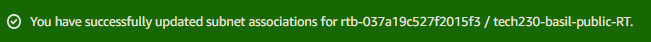

# Link IGW to RT
## Link IGW to only the public RT
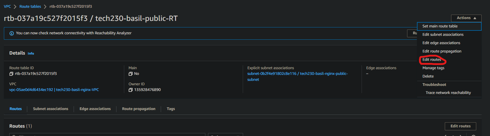
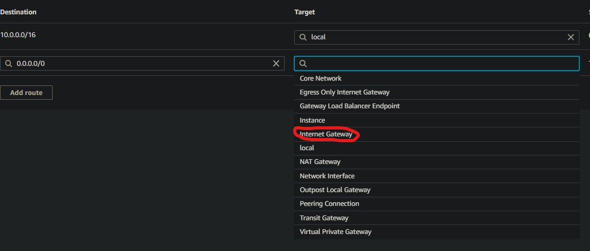
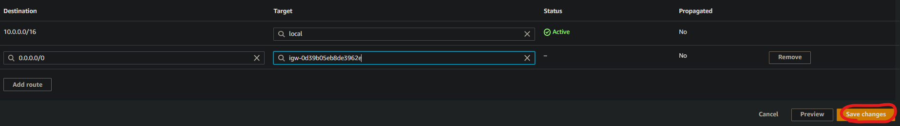
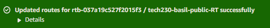
- If you go to your VPC page and scroll down the **Resource map** should look something like this: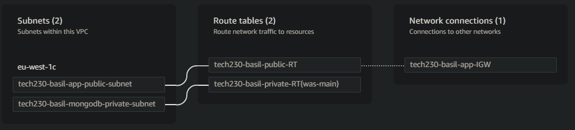

# Launching our EC2s
All remains the same as before except our network settings and security groups:

## For the DB(run first):
1. Make sure you are on the correct vpc and subnet(private)
2. Disable auto-assign public IP
3. Make a security group that allows:
- port(27017) from anywhere(so the app can access the db(we dont know the ip of the app so cannot set a specific ip, hence 0.0.0.0))
4. Use user data and provision script - to automatically get it up

  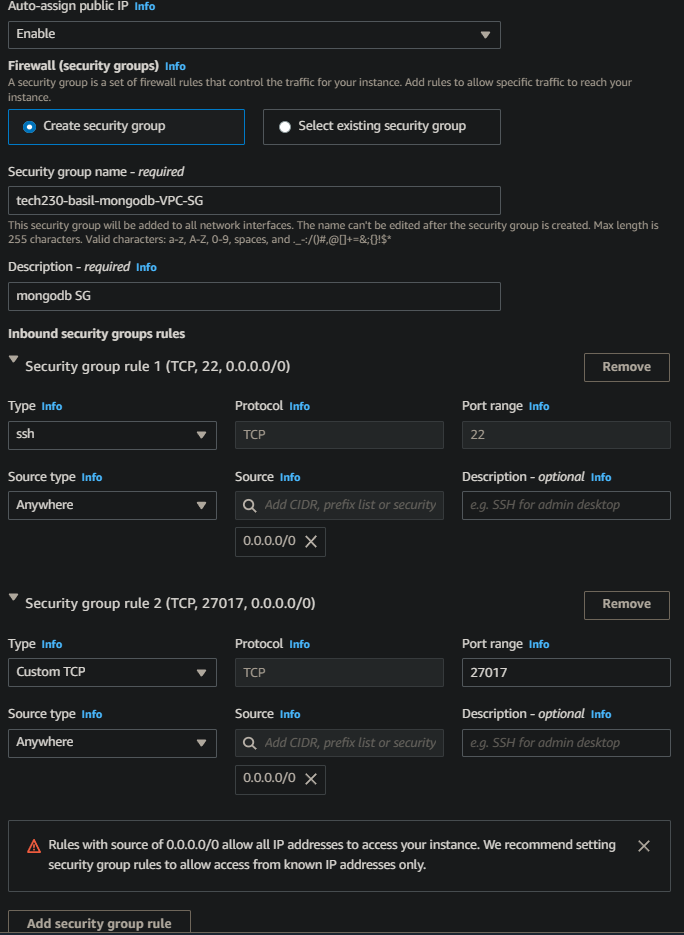
## For the app(run after db):
1. Make sure you are on the correct vpc and subnet(public)
2. Enable auto-assign public IP
3. Make a security group that allows SSH(22) to your IP
- SSH(22) to your IP
- HTTP(80) from anywhere (0.0.0.0)
1. make sure db is running already - **Manually** get the private IP from the DB EC2 page and add to **user data** environment variable DB_HOST.
2. use the **edited** user data and the provision script the get the app running automatically
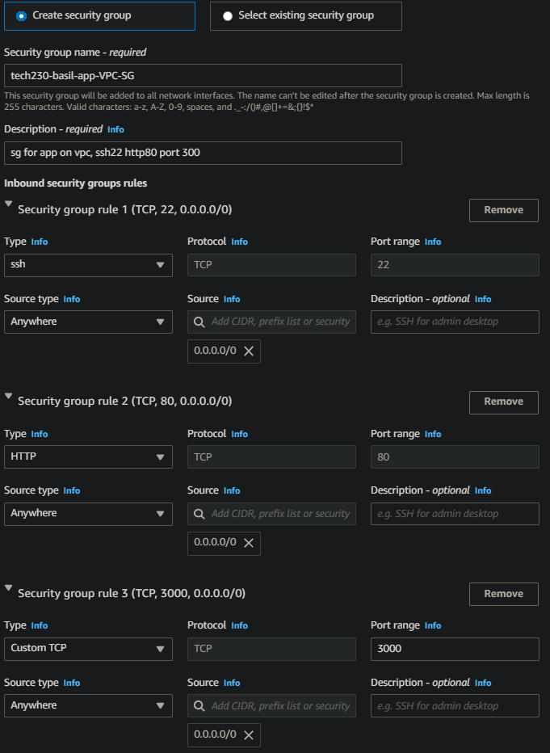

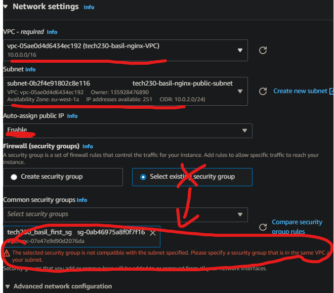
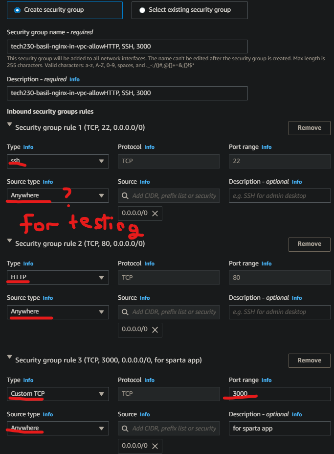
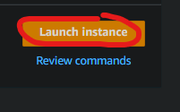
# Posts page should be working if all is done correctly
(on ubuntu 18.04 it took over 10 minutes to load (use ubuntu 20.04 for much faster loadtime)) : 
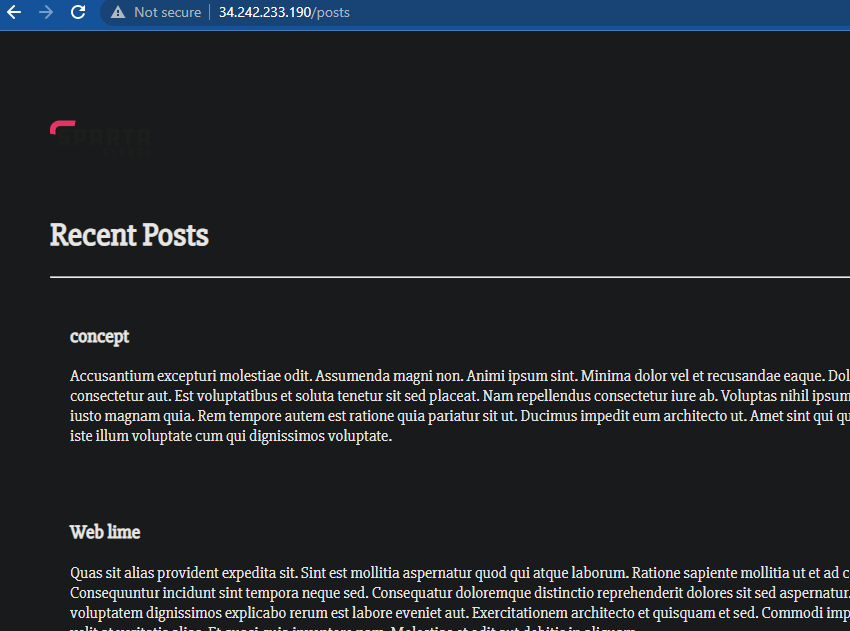