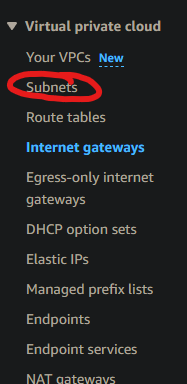

Glossary:
- VPC - Virtual Private Cloud
- IGW - Internet Gateway
- RT - Route table

# Create a VPC
1. 
2. 
3. 
4. 

# Create IGW
1. 

# Connect IGW to VPC
2. 

# Create subnet/s

# Create public RT

# Link public RT to subnet

.png)

# Link IGW to RT

# Launching our EC2s
All remains the same as before except our network settings:

