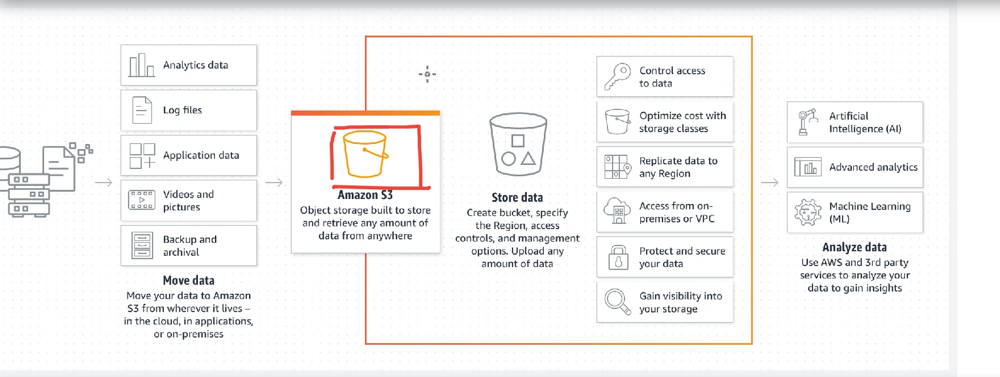
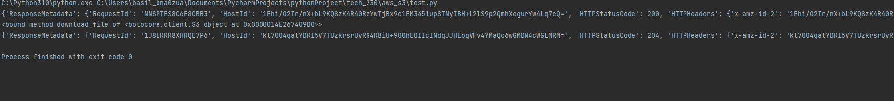
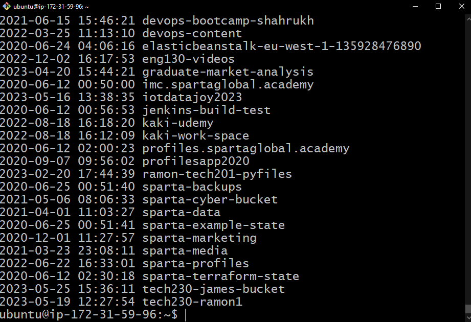

# S3
 Amazon S3 (Simple Storage Service) is a scalable cloud storage service provided by Amazon Web Services (AWS). It is designed to store and retrieve any amount of data from anywhere on the web. S3 offers a simple web services interface that allows developers to store and retrieve data from the cloud with high durability, availability, and security.

 With its durability, scalability, and flexibility, Amazon S3 is widely used for various purposes, including website hosting, backup and restore, content distribution, data archiving, data lakes, and big data analytics.
 
 # High Availability with S3
 Amazon S3 (Simple Storage Service) provides high availability through its architecture and design principles. Here's how S3 achieves high availability:

1. **Redundant Infrastructure**: Amazon S3 is designed with redundancy at its core. It replicates data across multiple geographically diverse Availability Zones (AZs) within a region. Each AZ is a physically separate data center with independent power, cooling, and networking infrastructure. This ensures that even if one AZ experiences an outage, data stored in other AZs remains accessible.

2. **Data Durability and Availability**: S3 automatically stores multiple copies of your objects within a region, offering high durability and availability. It uses built-in data redundancy mechanisms, such as cross-region replication and versioning, to protect against data loss or accidental deletion. This means that even in the event of hardware failures or other disruptions, S3 maintains the availability and integrity of your stored data.

3. **Fault Isolation**: S3 is designed to isolate failures to specific objects or parts of the system, minimizing the impact on the overall service. If a specific object or server experiences an issue, it does not affect the availability of other objects or the service as a whole. This fault isolation ensures that failures are contained and do not propagate to disrupt the entire S3 infrastructure.

4. **Automatic Scaling**: Amazon S3 automatically scales its storage capacity and performance to meet the demands of its users. It seamlessly handles high levels of concurrent requests and traffic by dynamically allocating resources as needed. This scalability ensures that S3 can handle varying workloads and maintain high availability even during periods of increased usage.

5. **SLA and Service Health Dashboard**: Amazon S3 provides a Service Level Agreement (SLA) that guarantees a certain level of availability for its service. AWS commits to a monthly uptime percentage, ensuring that S3 remains highly available and accessible to users. Additionally, AWS offers a Service Health Dashboard that provides real-time information about the status of AWS services, including S3. This allows users to monitor service health, performance, and any ongoing issues that may impact availability.

Overall, through its redundant infrastructure, data durability measures, fault isolation mechanisms, automatic scaling capabilities, and service level commitments, Amazon S3 provides high availability for storing and accessing data in the cloud.

 # Terminal commands to setup awscli
 ```
pip install awscli
 ```
- Install the AWS Command Line Interface (CLI) using pip

```
aws configure
``` 
- Configure the AWS CLI with your access key ID, secret access key, default region, and output format

```
aws s3 ls
``` 
- List all the S3 buckets  in your AWS account

```
aws s3 mb s3://tech230-basil-bucket --region eu-west-1
``` 
- Create a new S3 bucket  named "tech230-basil-bucket" in the EU (Ireland) region 

```
aws s3 cp sampletext.txt s3://tech230-basil-bucket
``` 
 - Upload a file named "sampletext.txt" to the "tech230-basil-bucket" bucket

```
aws s3 sync s3://tech230-basil-bucket s3_downloads
``` 
 - Sync (download) all files from the "tech230-basil-bucket" bucket  to the local directory "s3_downloads" 

```
aws s3 rm s3://tech230-basil-bucket/sampletext.txt
``` 
- Remove the file "sampletext.txt" from the "tech230-basil-bucket" bucket 

```
aws s3 rm s3://tech230-basil-bucket --recursive
``` 
- Remove all files and folders inside the "tech230-basil-bucket" bucket  recursively

```
aws s3 rb s3://tech230-basil-bucket
``` 
- Remove the empty "tech230-basil-bucket" bucket 


# Using Python (boto3) to automate CRUD operations:
```python
pip install boto3
```
Boto3 is a Python library provided by Amazon Web Services (AWS) that allows developers to interact with AWS services using Python code. It provides an easy-to-use API for creating, configuring, and managing AWS resources programmatically. With Boto3, developers can write Python applications that utilize various AWS services such as EC2, S3, DynamoDB, and more, making it simpler to automate tasks and build applications that integrate with AWS.

- Accessing and checking connection S3
```python
import boto3

# Connect to S3
s3 = boto3.resource("s3")

# List Buckets
for bucket in s3.buckets.all():
    print(bucket.name)
```
- Create a bucket
```
import boto3

# Connect to S3
s3 = boto3.client("s3")

# Create S3 Bucket
bucket_name = s3.create_bucket(Bucket = "tech230-basil-boto", CreateBucketConfiguration={"LocationConstraint": "eu-west-1"})

# Print Name
print(bucket_name)
```
-  Upload to bucket 
```python
import boto3

# Connect to S3
s3 = boto3.resource("s3")

# Opens the file we want to send, and stores it in a variable
data = open("sampletext.txt", "rb")

# Specify the bucket were sending to:
# ".put_object" names the file and sends the contents
s3.Bucket("tech230-basil-boto").put_object(Key = "sampletext.txt", Body = data)

# Can view on AWS to verify
```
-  Download from bucket 
```python
import boto3

# Connect to S3
s3 = boto3.client("s3")

#download from s3 
s3.download_file("tech230-basil-boto", "sampletext.txt", "sampletext1.txt")

print(s3.download_file)
```

-  Delete from bucket 
```python
import boto3

# Connect to S3
s3 = boto3.resource("s3")

# delete a file in a particular bucket
s3.Object("tech230-basil-boto", "sampletext.txt").delete()
```
-  Delete the bucket 
```python
import boto3

# Connect to S3

s3 = boto3.resource("s3")

bucket = s3.Bucket("tech230-basil-boto")
response = bucket.delete()

print(response)
```
If you run all the python commands your console should give an output similiar to:


# S3 authentication setup - with aws configure on EC2

1. launch and SSH into your EC2
2. Update and Upgrade your EC2
3. Install the AWS Command Line Interface (CLI): 
```
sudo apt-get install awscli
```
4. Configure AWS CLI with your access keys: Run the aws configure command and provide your Access Key ID, Secret Access Key, default region, and default output format when prompted. This information can be obtained from the AWS Management Console.
```
aws configure
AWS Access Key ID: <your_access_key_id>
AWS Secret Access Key: <your_secret_access_key>
Default region name: eu-west-1
Default output format: json

```
5. Done you are connected, to check your connection was successful you can 
```
aws s3 ls
```
and it should return something similiar to : 
